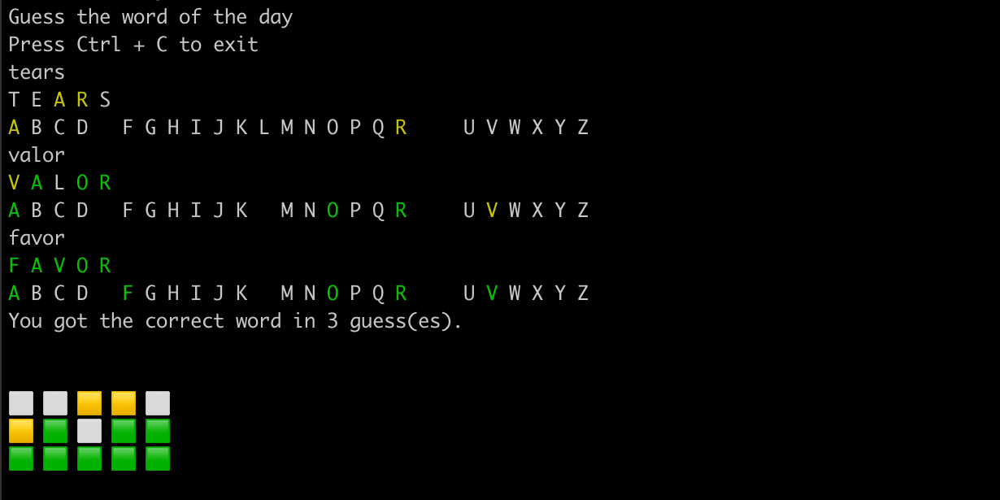

# Wordle

Play wordle in your shell.

Inspired from - https://www.powerlanguage.co.uk/wordle/

https://user-images.githubusercontent.com/14993828/149231796-7e151d08-2ee8-4975-bedc-450d7767dd7d.mp4



```console
bash-3.2$ ruby wordle.rb

Guess the word of the day
Press Ctrl + C to exit
tears
T E A R S
A B C D E F G H I J K L M N O P Q R S T U V W X Y Z
valor
V A L O R
A B C D E F G H I J K L M N O P Q R S T U V W X Y Z
favor
F A V O R
A B C D E F G H I J K L M N O P Q R S T U V W X Y Z
You got the correct word in 3 guess(es).

⬜ ⬜ 🟨 🟨 ⬜
🟨 🟩 ⬜ 🟩 🟩
🟩 🟩 🟩 🟩 🟩

Share with your friends using the link below:
https://twitter.com/intent/tweet?url=https://deepakmahakale.in/wordle&text=Play%20wordle%20in%20the%20shell.%0A%0AMy%20score%203/6%0A%0A%E2%AC%9C+%E2%AC%9C+%F0%9F%9F%A8+%F0%9F%9F%A8+%E2%AC%9C+%0A%F0%9F%9F%A8+%F0%9F%9F%A9+%E2%AC%9C+%F0%9F%9F%A9+%F0%9F%9F%A9+%0A%F0%9F%9F%A9+%F0%9F%9F%A9+%F0%9F%9F%A9+%F0%9F%9F%A9+%F0%9F%9F%A9+%0A%0A
```

```console
ruby <(curl -s https://deepakmahakale.in/wordle/wordle.rb)
```
